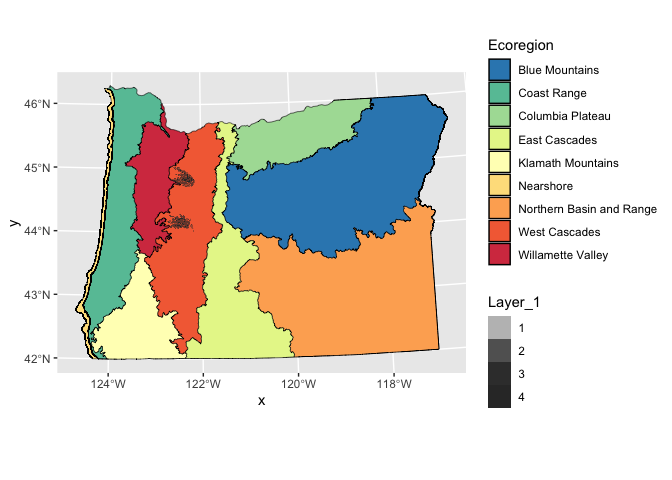

Lab 5: Oregon Fires
================
Lauren Ponisio

## Conservation/ecology Topics

> - Explore how Oregon fires are changing due to fire suppression and
>   climate change.
> - Describe fundamental concepts in fire ecology, including fire
>   severity.

# Statistical Topics

> - Describe the fundamental attributes of a raster dataset.

# Computational Topics

> - Explore raster attributes and metadata using R.
> - Import rasters into R using the `terra` package.
> - Plot raster files in R using the `ggplot2` package.
> - Reproject raster and vector data
> - Layer raster and vector data together

# Lab part 1: reading in fire raster data and plotting

We will be working with the soil burn severity data from the 2020
Holiday Farm Fire (up the McKenzie E of Eugene), the 2020 Beachie Fire
(near Portland) and the 2018 Terwilliger fire (up the McKenzie E of
Eugene, near Cougar hotsprings).

We will use data downloaded from the USGS:
<https://burnseverity.cr.usgs.gov/products/baer>

Specifically, BARC Fire Severity layers are created by first calculating
spectral indices from pre- and post-fire satellite imagery that are
sensitive to changes caused by fire. The two images are then subtracted
showing the difference between them which is then binned into 4 burn
severity classes (high, moderate, low, very low/unburned). Field crews
ground-truth the severity classes.

The metadata files provide additional details on how the continuous data
was binned into discrete catagories.

1.  Read in each fire severity rasters, name them \[fire name\]\_rast.
    The .tif files are the rasters.

HINT: The files are nested within folders so be aware of your file
paths.

``` r
#rast() used to call data from files
Terwilliger_rast <- rast("soil-burn-severity/2018_terwilliger_sbs/SoilSeverity.tif")
BeachieCreek_rast <- rast("soil-burn-severity/2020_beachiecreek_sbs/BeachieCreek_SBS_final.tif")
HolidayFarm_rast <- rast("soil-burn-severity/2020_holidayfarm_sbs/HolidayFarm_SBS_final.tif")

Terwilliger_rast
```

    ## class       : SpatRaster 
    ## dimensions  : 509, 259, 1  (nrow, ncol, nlyr)
    ## resolution  : 30, 30  (x, y)
    ## extent      : 418945.4, 426715.4, 1104668, 1119938  (xmin, xmax, ymin, ymax)
    ## coord. ref. : NAD83 / USFS R6 Albers 
    ## source      : SoilSeverity.tif 
    ## categories  : SoilBurnSe, BAER_Acres 
    ## name        : SoilBurnSe 
    ## min value   :   Unburned 
    ## max value   :       High

``` r
BeachieCreek_rast
```

    ## class       : SpatRaster 
    ## dimensions  : 1894, 2316, 1  (nrow, ncol, nlyr)
    ## resolution  : 20, 20  (x, y)
    ## extent      : 388929.2, 435249.2, 1183362, 1221242  (xmin, xmax, ymin, ymax)
    ## coord. ref. : IMAGINE GeoTIFF Support
    ## ERDAS IMAGINE 2014  14.0.0.181
    ## Projection = Albers Conical Equal Area 
    ## source      : BeachieCreek_SBS_final.tif 
    ## color table : 1 
    ## name        : Layer_1 
    ## min value   :       1 
    ## max value   :      NA

``` r
HolidayFarm_rast
```

    ## class       : SpatRaster 
    ## dimensions  : 1448, 2270, 1  (nrow, ncol, nlyr)
    ## resolution  : 20, 20  (x, y)
    ## extent      : 517347.8, 562747.8, 4875154, 4904114  (xmin, xmax, ymin, ymax)
    ## coord. ref. : NAD83 / UTM zone 10N (EPSG:26910) 
    ## source      : HolidayFarm_SBS_final.tif 
    ## color table : 1 
    ## name        : Layer_1 
    ## min value   :       1 
    ## max value   :      NA

2.  Summarize the values of the rasters. Take note of the labels
    associated with the data values because you will need it for
    plotting.

``` r
summary(values(HolidayFarm_rast))
```

    ##     Layer_1      
    ##  Min.   :  1.00  
    ##  1st Qu.:  3.00  
    ##  Median :  4.00  
    ##  Mean   : 60.83  
    ##  3rd Qu.:127.00  
    ##  Max.   :127.00

``` r
summary(values(Terwilliger_rast))
```

    ##    SoilBurnSe   
    ##  Min.   :1.00   
    ##  1st Qu.:2.00   
    ##  Median :2.00   
    ##  Mean   :1.92   
    ##  3rd Qu.:2.00   
    ##  Max.   :4.00   
    ##  NA's   :80287

``` r
summary(values(BeachieCreek_rast))
```

    ##     Layer_1      
    ##  Min.   :  1.00  
    ##  1st Qu.:  3.00  
    ##  Median :127.00  
    ##  Mean   : 71.77  
    ##  3rd Qu.:127.00  
    ##  Max.   :127.00

3.  Plot each raster.. Set the scale to be
    `scale_fill_brewer(palette = "Spectral", direction=-1)`

HINT: Remember we have to turn them into “data.frames” for ggplot to
recognize them as plot-able.

HINT HINT: Remember to check the labels of the data values to be able to
set the fill.

``` r
HolidayFarm_DF <- as.data.frame(HolidayFarm_rast, xy = TRUE)
head(HolidayFarm_DF)# check the 3rd col to get the fill
```

    ##              x       y Layer_1
    ## 89717 541077.8 4903324       1
    ## 89718 541097.8 4903324       1
    ## 89719 541117.8 4903324       1
    ## 89720 541137.8 4903324       1
    ## 89721 541157.8 4903324       1
    ## 89722 541177.8 4903324       1

``` r
ggplot()+ 
  geom_raster(data= HolidayFarm_DF, aes(x= x, y= y, fill= Layer_1 ))+ 
  scale_fill_brewer(palette = "Spectral", direction=-1)
```

    ## Warning: Raster pixels are placed at uneven horizontal intervals and will be shifted
    ## ℹ Consider using `geom_tile()` instead.

<figure>

<figcaption aria-hidden="true">Holiday plot with ggplot2 using the
Spectral color scale</figcaption>
</figure>

``` r
BeachieCreek_DF <- as.data.frame(BeachieCreek_rast, xy = TRUE)
head(BeachieCreek_DF)# check the 3rd col to get the fill
```

    ##             x       y Layer_1
    ## 345  395819.2 1221232       2
    ## 346  395839.2 1221232       2
    ## 347  395859.2 1221232       2
    ## 348  395879.2 1221232       2
    ## 349  395899.2 1221232       2
    ## 2659 395779.2 1221212       2

``` r
ggplot()+ 
  geom_raster(data= BeachieCreek_DF, aes(x= x, y= y, fill= Layer_1 ))+ 
  scale_fill_brewer(palette = "Spectral", direction=-1)
```

    ## Warning: Raster pixels are placed at uneven horizontal intervals and will be shifted
    ## ℹ Consider using `geom_tile()` instead.

<figure>

<figcaption aria-hidden="true">Beachie plot with ggplot2 using the
Spectral color scale</figcaption>
</figure>

``` r
Terwilliger_DF <- as.data.frame(Terwilliger_rast, xy = TRUE)
head(Terwilliger_DF)# check the 3rd col to get the fill
```

    ##           x       y SoilBurnSe
    ## 31 419860.4 1119923   Unburned
    ## 32 419890.4 1119923        Low
    ## 33 419920.4 1119923   Unburned
    ## 34 419950.4 1119923        Low
    ## 47 420340.4 1119923        Low
    ## 48 420370.4 1119923        Low

``` r
ggplot()+ 
  geom_raster(data= Terwilliger_DF, aes(x= x, y= y, fill= SoilBurnSe ))+ 
  scale_fill_brewer(palette = "Spectral", direction=-1)
```

<figure>

<figcaption aria-hidden="true">Terwilliger plot with ggplot2 using the
Spectral color scale</figcaption>
</figure>

4.  Compare these visualizations what is something you notice? -ANSWER:
    I notice that besides them looking the same, the first two fires are
    measured with a different criteria then the last. The holiday Farm
    and Beachie Creek fires were measured on a level from 1-4, while the
    Terwilliger fire was measured with unburned, low, moderate, and
    high.

# Lab part 2: Exploring the attributes of our spatial data.

1.  What are the crs of the rasters? What are the units? Are they all
    the same?

``` r
crs(HolidayFarm_rast, proj = TRUE)
```

    ## [1] "+proj=utm +zone=10 +datum=NAD83 +units=m +no_defs"

``` r
crs(BeachieCreek_rast, proj = TRUE)
```

    ## [1] "+proj=aea +lat_0=34 +lon_0=-120 +lat_1=43 +lat_2=48 +x_0=600000 +y_0=0 +datum=NAD83 +units=m +no_defs"

``` r
crs(Terwilliger_rast, proj = TRUE)
```

    ## [1] "+proj=aea +lat_0=34 +lon_0=-120 +lat_1=43 +lat_2=48 +x_0=600000 +y_0=0 +datum=NAD83 +units=m +no_defs"

- ANSWER crs: Holiday:“+proj=utm +zone=10 +datum=NAD83 +units=m
  +no_defs” Beachie:“+proj=aea +lat_0=34 +lon_0=-120 +lat_1=43 +lat_2=48
  +x_0=600000 +y_0=0 +datum=NAD83 +units=m +no_defs”
  Terwilliger:“+proj=aea +lat_0=34 +lon_0=-120 +lat_1=43 +lat_2=48
  +x_0=600000 +y_0=0 +datum=NAD83 +units=m +no_defs”

- ANSWER units: Holiday:m Beachie:m Terwilliger:m

- ANSWER the same? : The Holiday Farm has diffrent crs then the other
  two fires.

2.  What about the resolution of each raster?

``` r
res(HolidayFarm_rast)
```

    ## [1] 20 20

``` r
res(BeachieCreek_rast)
```

    ## [1] 20 20

``` r
res(Terwilliger_rast)
```

    ## [1] 30 30

- ANSWER resolution: Holiday:20 x 20 Beachie:20 x 20 Terwilliger:30 x 30
- ANSWER the same? : No, Holiday and Beachie are the same but
  Terwilliger is bigger.

3.  Calculate the min and max values of each raster. Are they all the
    same?

``` r
minmax(HolidayFarm_rast)
```

    ##     Layer_1
    ## min       1
    ## max     127

``` r
minmax(BeachieCreek_rast)
```

    ##     Layer_1
    ## min       1
    ## max     127

``` r
minmax(Terwilliger_rast)
```

    ##     SoilBurnSe
    ## min          1
    ## max          4

- ANSWER minmax: Holiday: Min: 1 Max: 127 Beachie: Min: 1 Max: 127
  Terwilliger: Min: 1 Max: 4
- ANSWER the same? : The Holiday and Beachie have a min of 1 and max
  of 127. This is diffrent for the Terwillger fire that has a min of 1
  and max of 4

Given we expect there to be 4 values for each bin of severity (high,
moderate, low, very low/unburned), let’s try to work out why there are
values other than 1-4. After checking the metadata .txt and inspecting
the metadata in the raster itself, I could not find an explicit mention
of the meaning on the non 1-4 data (maybe you can?). Not great practices
USGS! But it is likely missing data. Let’s convert the Holiday data
greater than 4 to NA, just like we would a regular matrix of data.

``` r
HolidayFarm_rast[HolidayFarm_rast > 4] <- NA
summary(values(HolidayFarm_rast))
```

    ##     Layer_1       
    ##  Min.   :1.0      
    ##  1st Qu.:2.0      
    ##  Median :3.0      
    ##  Mean   :2.8      
    ##  3rd Qu.:3.0      
    ##  Max.   :4.0      
    ##  NA's   :1536190

That’s better :)

4.  Do the same conversion for Beachie.

``` r
BeachieCreek_rast[BeachieCreek_rast > 4] <- NA
summary(values(BeachieCreek_rast))
```

    ##     Layer_1       
    ##  Min.   :1.0      
    ##  1st Qu.:2.0      
    ##  Median :3.0      
    ##  Mean   :2.7      
    ##  3rd Qu.:3.0      
    ##  Max.   :4.0      
    ##  NA's   :2437627

# Lab part 3: Reprojection

From our exploration above, the rasters are not in the same projection,
so we will need to re-project them if we are going to be able to plot
them together.

We can use the `project()` function to reproject a raster into a new
CRS. The syntax is `project(RasterObject, crs)`

1.  First we will reproject our `beachie_rast` raster data to match the
    `holidat_rast` CRS. If the resolution is different, change it to
    match Holiday’s resolution.

Don’t change the name from beachie_rast.

``` r
BeachieCreek_rast <- project(BeachieCreek_rast, crs(HolidayFarm_rast))
# This should return TRUE
crs(BeachieCreek_rast, proj = TRUE) == crs(HolidayFarm_rast, proj = TRUE)
```

    ## [1] TRUE

2.  Now convert the Terwilliger crs to the holiday crs. If the
    resolution is different, change it to match Holiday’s resolution.

``` r
Terwilliger_rast <- project(Terwilliger_rast, crs(HolidayFarm_rast), res = res(HolidayFarm_rast))

# This should return TRUE TRUE
crs(Terwilliger_rast, proj = TRUE) == crs(HolidayFarm_rast, proj = TRUE)
```

    ## [1] TRUE

``` r
res(Terwilliger_rast)[2] == res(HolidayFarm_rast)[2]
```

    ## [1] TRUE

3.  Now you can plot all of the fires on the same map! HINT: Remember to
    re-make the dataframes.

``` r
HolidayFarm_NEWDF <- as.data.frame(HolidayFarm_rast, xy = TRUE)
BeachieCreek_NEWDF <- as.data.frame(BeachieCreek_rast, xy = TRUE)
Terwilliger_NEWDF <- as.data.frame(Terwilliger_rast, xy = TRUE)
head(HolidayFarm_NEWDF)
```

    ##              x       y Layer_1
    ## 89717 541077.8 4903324       1
    ## 89718 541097.8 4903324       1
    ## 89719 541117.8 4903324       1
    ## 89720 541137.8 4903324       1
    ## 89721 541157.8 4903324       1
    ## 89722 541177.8 4903324       1

``` r
head(BeachieCreek_NEWDF)
```

    ##               x       y Layer_1
    ## 150967 538092.4 4986280       2
    ## 150968 538112.4 4986280       2
    ## 150969 538132.4 4986280       2
    ## 150970 538152.4 4986280       2
    ## 153350 538032.4 4986260       1
    ## 153351 538052.4 4986260       2

``` r
ggplot()+ 
  geom_raster(data= BeachieCreek_NEWDF, aes(x= x, y= y, fill= Layer_1 ))+ 
  geom_raster(data= HolidayFarm_NEWDF, aes(x= x, y= y, fill= Layer_1 ))+ 
  geom_raster(data= Terwilliger_NEWDF, aes(x= x, y= y, fill= SoilBurnSe ))+ 
  scale_fill_brewer(palette = "Spectral", direction=-1)
```

    ## Warning: Raster pixels are placed at uneven horizontal intervals and will be shifted
    ## ℹ Consider using `geom_tile()` instead.
    ## Raster pixels are placed at uneven horizontal intervals and will be shifted
    ## ℹ Consider using `geom_tile()` instead.

<!-- -->

Well that’s annoying. It appears as though in 2018 the makers of these
data decided to give 1,2,3,4 categorical names which are being
interpreted as two different scales. If we look at the terwilliger_rast
values we can see that in min max.

``` r
Terwilliger_rast$SoilBurnSe
```

    ## class       : SpatRaster 
    ## dimensions  : 776, 417, 1  (nrow, ncol, nlyr)
    ## resolution  : 20, 20  (x, y)
    ## extent      : 558901, 567241, 4870585, 4886105  (xmin, xmax, ymin, ymax)
    ## coord. ref. : NAD83 / UTM zone 10N (EPSG:26910) 
    ## source(s)   : memory
    ## categories  : SoilBurnSe, BAER_Acres 
    ## name        : SoilBurnSe 
    ## min value   :   Unburned 
    ## max value   :       High

4.  Let’s deal with the the easy way and modify the dataframe. Convert
    High to 4, Moderate to 3, Low to 2, and Unburned to 1 using your
    data subsetting skills.

Somethings you will need to be careful of: - If you check the class of
terwilliger_rast_df\$SoilBurnSe it is a factor, which is a special class
of data that are ordered categories with specific levels. R will not let
you convert add a level. So first, convert the data to characters (using
as.character()). - Now the data are characters, so you will not be able
to add in numerics. So code the 1,2,3 as characters i.e., “1”, “2”… - We
will eventually want the data to be factors again so it will match up
with the other rasters. So lastly, convert the data to a factor (using
as.factor()).

``` r
#convert from factor to character 
Terwilliger_NEWDF$SoilBurnSe <- as.character(Terwilliger_NEWDF$SoilBurnSe)
#convert high, moderate, etc to 1, 2, 3, 4
Terwilliger_NEWDF$SoilBurnSe[Terwilliger_NEWDF$SoilBurnSe == "High"] <- "4"
Terwilliger_NEWDF$SoilBurnSe[Terwilliger_NEWDF$SoilBurnSe == "Moderate"] <- "3"
Terwilliger_NEWDF$SoilBurnSe[Terwilliger_NEWDF$SoilBurnSe == "Low"] <- "2"
Terwilliger_NEWDF$SoilBurnSe[Terwilliger_NEWDF$SoilBurnSe == "Unburned"] <- "1"
#change em back to a factor
Terwilliger_NEWDF$SoilBurnSe <- as.factor(Terwilliger_NEWDF$SoilBurnSe)

head(Terwilliger_NEWDF$SoilBurnSe)
```

    ## [1] 2 2 2 1 2 2
    ## Levels: 1 2 3 4

5.  Try plotting again.

``` r
ggplot()+ 
  geom_raster(data= Terwilliger_NEWDF, aes(x= x, y= y, fill= SoilBurnSe ))+ 
  geom_raster(data= HolidayFarm_NEWDF, aes(x= x, y= y, fill= Layer_1 ))+ 
  geom_raster(data= BeachieCreek_NEWDF, aes(x= x, y= y, fill= Layer_1 ))+ 
  scale_fill_brewer(palette = "Spectral", direction=-1)
```

    ## Warning: Raster pixels are placed at uneven horizontal intervals and will be shifted
    ## ℹ Consider using `geom_tile()` instead.
    ## Raster pixels are placed at uneven horizontal intervals and will be shifted
    ## ℹ Consider using `geom_tile()` instead.

<!-- -->
The scale bar make sense! It would be nice to have a baselayer map to
see where is Oregon these fires are.

# Lab part 4: Adding in vector data

I found a nice ecoregion map on the OR spatial data website.
<https://spatialdata.oregonexplorer.info/geoportal/details;id=3c7862c4ae664993ad1531907b1e413e>

1.  Load the data into R, it is in the OR-ecoregions folder.

``` r
#loads data
EcoregionMap_vector <- st_read("OR-ecoregions/Ecoregions_OregonConservationStrategy.shp")
```

    ## Reading layer `Ecoregions_OregonConservationStrategy' from data source 
    ##   `/Users/vincentcortes/Desktop/BI 410L/5-OR-fires/OR-ecoregions/Ecoregions_OregonConservationStrategy.shp' 
    ##   using driver `ESRI Shapefile'
    ## Simple feature collection with 9 features and 6 fields
    ## Geometry type: POLYGON
    ## Dimension:     XY
    ## Bounding box:  xmin: 183871.7 ymin: 88600.88 xmax: 2345213 ymax: 1675043
    ## Projected CRS: NAD83 / Oregon GIC Lambert (ft)

2.  Check the projection and re-project if needed. We did not cover this
    in the lecture demo, but for vector data, use st_transform()

``` r
# Get the CRS from HolidayFarm_rast
holiday_crs <- crs(HolidayFarm_rast, proj = TRUE)

# Reproject vector data to match raster CRS
EcoregionMap_vector <- st_transform(EcoregionMap_vector, holiday_crs)


# This should return TRUE
crs(EcoregionMap_vector, proj = TRUE) == crs(HolidayFarm_rast, proj = TRUE)
```

    ## [1] TRUE

``` r
crs(EcoregionMap_vector, proj = TRUE) == crs(Terwilliger_rast, proj = TRUE)
```

    ## [1] TRUE

``` r
crs(EcoregionMap_vector, proj = TRUE) == crs(BeachieCreek_rast, proj = TRUE)
```

    ## [1] TRUE

3.  Plot all of the data together (the rasters and vector data). You can
    layer on geom_sf into ggplot with the other rasters just like you
    would add another raster.

``` r
ggplot() + 
  geom_sf(data = EcoregionMap_vector, aes(fill= Ecoregion), color= "black") + 
  geom_raster(data = HolidayFarm_NEWDF, aes(x = x, y = y, alpha = Layer_1)) + 
  geom_raster(data = BeachieCreek_NEWDF, aes(x = x, y = y, alpha = Layer_1)) + 
  geom_raster(data = Terwilliger_NEWDF, aes(x = x, y = y, alpha = SoilBurnSe)) + 
  scale_fill_brewer(palette = "Spectral", direction = -1)+
  coord_sf()
```

    ## Warning: Using alpha for a discrete variable is not advised.

    ## Warning: Raster pixels are placed at uneven horizontal intervals and will be shifted
    ## ℹ Consider using `geom_tile()` instead.
    ## Raster pixels are placed at uneven horizontal intervals and will be shifted
    ## ℹ Consider using `geom_tile()` instead.

<!-- -->
We could get fancy and zoom into the correct region using extent, which
we will cover next week. For now, this looks pretty good.

# Lab part 5: Exploring patterns of fire severity

1.  Create a barplot with the count of each fire severity category.

- Use scale_fill_brewer(palette = “Spectral”, direction=-1) to get the
  bars to match the maps.
- Plot the proportion on the y. To do this, in geom_bar, include y =
  (..count..)/sum(..count..). EX: aes(x= Layer_1, y =
  (..count..)/sum(..count..)

HINT: Rather annoyingly, you will need to convert the layer values to
factors again to get fill to recognize them. EX: fill=as.factor(Layer_1)

``` r
# converts values to factor
HolidayFarm_NEWDF$Layer_1 <- as.factor(HolidayFarm_NEWDF$Layer_1)
Terwilliger_NEWDF$SoilBurnSe <- as.factor(Terwilliger_NEWDF$SoilBurnSe)
BeachieCreek_NEWDF$Layer_1 <- as.factor(BeachieCreek_NEWDF$Layer_1)

Terwilliger_NEWDF$Fire <- "Terwilliger"
HolidayFarm_NEWDF$Fire <- "HolidayFarm"
BeachieCreek_NEWDF$Fire <- "BeachieCreek"

allFires_DF <- rbind(data.frame(Fire="HolidayFarm", Layer_1 = HolidayFarm_NEWDF$Layer_1),
                     data.frame(Fire="Terwilliger", Layer_1 = Terwilliger_NEWDF$SoilBurnSe),
                     data.frame(Fire="BeachieCreek", Layer_1 = BeachieCreek_NEWDF$Layer_1))
#Plot
ggplot(allFires_DF, aes(x = "Severity Level", y = (..count..)/sum(..count..), fill = as.factor(Layer_1))) +
  geom_bar() +
  scale_fill_brewer(palette = "Spectral", direction = -1) +
  labs(x = "Fire Severity Category", y = "Proportion", fill = "Severity Level") +
  theme_minimal() +
  ggtitle("Proportion of Each Fire Severity Category")+
facet_wrap(~Fire)
```

    ## Warning: The dot-dot notation (`..count..`) was deprecated in ggplot2 3.4.0.
    ## ℹ Please use `after_stat(count)` instead.
    ## This warning is displayed once every 8 hours.
    ## Call `lifecycle::last_lifecycle_warnings()` to see where this warning was
    ## generated.

<!-- --> b. What do you
notice about the frequency of different severity classes when you
compare these barplots. How does this relate to the Haldofsky reading?
ANSWER: After looking at the bar plot I can notice that level 3 burn
severity is the largest in each of the large fires. This is a large
proportion compared to the other levels. This relates to Halofsky
because we could see that there are higher severity of burn areas due to
the changing of the climate and fire regimes.

Also, if the legend label bothers you (as it does for me) Check out this
tutorial:
<https://www.datanovia.com/en/blog/ggplot-legend-title-position-and-labels/>
