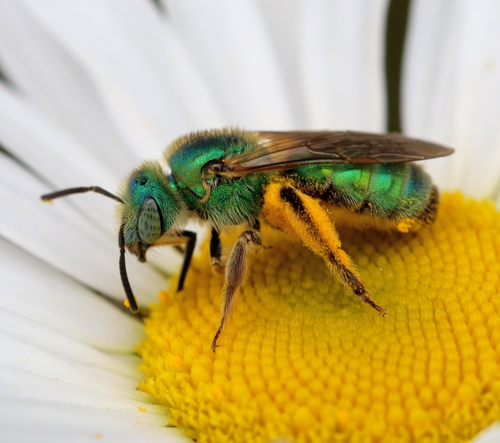

<!-- Lesson Overview -->

# Conservation/ecology Topics 

> - Species distributions 

# Computational Topics
> -  Convert a data frame to a spatial object.
> -  Plot multiple spatial layers.

-------------------------------
```{r load-libraries, echo=FALSE, results="hide", message=FALSE, warning=FALSE}
library(terra)
library(ggplot2)
library(dplyr)
library(sf)
library(maps)
```

# Lab part 1: Oregon bee atlas data exploration 

a. Import the OBA data.
```{r}
OBAdata <- read.csv("OBA_2018-2023.csv")

head(OBAdata)
```

b. Find the columns related to genus and species and paste them together (with a space between) using the function paste(). Name the new column GenusSpecies.
```{r}
GenusSpecies <- paste(OBAdata$Genus, OBAdata$Species, sep=" ", recycle0 = FALSE)

head(GenusSpecies)
```

c. Use `sort()` and `unique()` to print the unique values of GenusSpecies in alphabetical order.  How many species are there? 

```{r}
head(sort(unique(GenusSpecies)))
```

Some specimens are not identified to species, only genus. How is this reflected in the data? 
In two weeks we will learn how to clean this up using regular expressions. 

d. So many bees, so little time. Count up the occurrences of each bee species, and subset the data to bees that have been seen at least two times. 
You can use the tidyverse or any other functions in R that you like. How many "species" are there? 

```{r}
bee_counts <- OBAdata%>%
  mutate(GenusSpecies = paste(Genus, Species, sep=" ")) %>%
  group_by(GenusSpecies) %>%
  tally() %>%
  filter(n >= 2)

head(bee_counts)

num_species <- nrow(bee_counts)
num_species
```

e. Google a few bee names (that have been seen > 2 times) and find one with an a look that resonates with you.

What is the name of your bee? 

Agapostemon texanus

Import the photos into Rmarkdown below (hint: googling bee name "discover life" or "inat" can often get you a photo. Many bees will no have any photos :( 



# Lab part 2: Plotting the distrubution of your spirit bee. 

How that have chosen your spirit bee, we would like to plot it's distribution. What is the crs of the data? Annoyingly it is not described anywhere in the spreadsheet (always list your crs in your data) but it is the same as what inat uses because all bees have a georeferenced plant host. If the data is in lat long, it is "unprojected" so only a datum will be listed. 
DATUM: WGS84, unprojected lat long. EPSG code: 4326. 


```{r}

crs("EPSG:4326")

```

a. Extract the X and Y locations for your species only from the data and create a spatial object. Don't forget to set the CRS! 
Hint 1: consider what other data you would like to keep as attributes, for example what flower they were foraging on. Hint 2: Remember the lat is y and long is x. 
Hint 3: You may want to rename the column names you can use, colnames() and reassign the names, since the ones in the oba data spreadsheet are really ugly. 

```{r}
# Filter the data for Agapostemon texanus
spirit_bee_data <- OBAdata %>%
  filter(paste(Genus, Species, sep=" ") == "Agapostemon texanus") %>%
  select(Longitude = Dec..Long., Latitude = Dec..Lat., Flower = Associated.plant)

# Renames columns 
colnames(spirit_bee_data) <- c("Longitude", "Latitude", "Flower")

# Convert the filtered data to a spatial object
spirit_bee_sf <- st_as_sf(spirit_bee_data, coords = c("Longitude", "Latitude"), crs = 4326)

# Display the spatial object
print(spirit_bee_sf)


spirit_bee_sf <- spirit_bee_sf[spirit_bee_sf$Flower != "",]
spirit_bee_sf <- spirit_bee_sf[spirit_bee_sf$Flower != "Salix sp., Achillea millefolium (Yarrow) and Conium maculatum (poison hemlock)",]
sort(unique(spirit_bee_sf$Flower))

```

b. Plot your exciting bee data!

```{r plot-data-points}
ggplot(data = spirit_bee_sf) +
  geom_sf(color = "orange", size = 3, alpha = 0.6) + 
  labs(title = "Distribution of Agapostemon texanus",
       x = "Longitude",
       y = "Latitude") +
  theme_minimal()
```

Not so exciting without some kind of background... 

Luckily we can download basemaps into R using the map_data function in ggplot (among many others). There is an example for retrieving the Oregon county polygons. 

```{r plot-or}
or <- map_data("county", "oregon") %>% 
  select(long = long, lat, group, id = subregion)

```

c. Add your species's points to your choice or an Oregon basemap. 

```{r plot-data-points-basemap}
library(ggspatial)

ggplot() +
  geom_polygon(data = or, aes(x = long, y = lat, group = group), 
               fill = "lightgrey", color = "white") +
  
  geom_sf(data = spirit_bee_sf, color = "orange", size = 3, alpha = 0.7) +
  labs(title = "Distribution of Agapostemon texanus in Oregon",
       x = "Longitude", 
       y = "Latitude") +
  theme_minimal() +
  coord_sf()

```
# Lab part 3: Cartography

a. Here is your moment to explore your cartographic skills. 
1. Add another spatial layer relevant to your final project and tweek the Oregon map in anyway that is useful/visually appealing. You may need to crop that layer to the extent of your species's distribution. 
2. Color your points according to some data attribute and add a legend (month collected, county, collector, associated plant, whatever you think is interesting). You may need to circle back to 2.1 to save
additional attributes when you converted the dataframe to a spatial object. 
3. Fine-tune your map: add a title, make sure the legend label makes sense, add a scale bar (google "add scale bar map ggplot" and choose your favorite package). All maps must always have a scale bar. You can add a N arrow as well, though some cartographers argue that is only necessary if N isn't at the top of the map.
4. Write a figure caption for your map explaining any interesting trends you see. 
5. Export you cropped layer to a .shp so you can use it again for your final project.
6. Push this lab to your github repo (just the .Rmd, don't push the data!)

```{r plot-creative}
fire_data <- terra::rast("HolidayFarm_SBS_final.tif") 
fire_data <- terra::project(fire_data, st_crs(spirit_bee_sf)$wkt)
fire_data_cropped <- terra::crop(fire_data, terra::ext(spirit_bee_sf))
fire_df <- as.data.frame(fire_data_cropped, xy = TRUE, na.rm = TRUE)

or_sf <- st_as_sf(map_data("county", "oregon"), coords = c("long", "lat"), crs = 4326)
fire_data_oregon <- terra::crop(fire_data, terra::ext(or_sf))
fire_data_cropped <- terra::crop(fire_data_oregon, terra::ext(spirit_bee_sf))

ggplot() +
  # Oregon counties map
  geom_polygon(data = or, aes(x = long, y = lat, group = group), 
               fill = "lightgrey", color = "white") +
  geom_raster(data = fire_df, aes(x = x, y = y, fill = HolidayFarm_SBS_final)) +
  # Spirit bee data points
  geom_sf(data = spirit_bee_sf, aes(color =Flower), size = 3, alpha = 0.8) +
  # Add a scale bar
  annotation_scale(location = "bl", width_hint = 0.5) +
  # Add a north arrow
  annotation_north_arrow(location = "br", which_north = "true", 
                         style = north_arrow_fancy_orienteering) +
  labs(title = "Distribution of Agapostemon texanus and Wildfire Data",
       subtitle = "Colored by Associated Plant",
       color = "Associated Plant",
       fill = "Fire Intensity",
       x = "Longitude", 
       y = "Latitude") +
  theme_minimal() +
  
  theme(
    legend.position = "bottom", # Position legend at the top
    plot.title = element_text(hjust = 0.5, face = "bold", size = 14, margin = margin(b = 10)),
    plot.subtitle = element_text(hjust = 0.5, size = 12)
  ) +
  coord_sf()
```

We are looking forward to seeing the maps you create! 

# Lab part 4: Spatial summary statistics
 For your final projects, you will likely need to come up with summary statistics that describes the areas around where bees are captured. 
a. Using the distribution of your chosen bee and the spatial layer you imported in 2.6, extract a meaningful summary statistics from your spatial layer within a buffer of 500, 750 1000 km.
b. Create a plot that illustrates this summary data (box plot, barplot, scatter plot, historgram). 
c. Create a map of your cropped spatial data.

```{r buffers}
#alittle confused how to work with this fire dataset, I think this this incorrect, maybe if I used a better dataset, this would work better.

#Found this package online, that loads data faster???
library(exactextractr)

# Create buffers 
buffer_500 <- st_buffer(spirit_bee_sf, dist = 50000)  # 50 km
buffer_750 <- st_buffer(spirit_bee_sf, dist = 80000)  # 80 km
buffer_1000 <- st_buffer(spirit_bee_sf, dist =100000) # 100 km

# Extracts the mean fire intensity for each buffer distance
fire_mean_500 <- exact_extract(fire_data_cropped, buffer_500, fun = "mean")
fire_mean_750 <- exact_extract(fire_data_cropped, buffer_750, fun = "mean")
fire_mean_1000 <- exact_extract(fire_data_cropped, buffer_1000, fun = "mean")

# This will combine results into a DF
fire_summary <- data.frame(
  Distance = rep(c("50 km", "80 km", "100 km"), 
                 times = c(length(fire_mean_500), length(fire_mean_750), length(fire_mean_1000))),
  FireIntensity = c(fire_mean_500, fire_mean_750, fire_mean_1000)
)


ggplot() +
  geom_polygon(data = or, aes(x = long, y = lat, group = group), 
               fill = "lightgrey", color = "white") +
  geom_raster(data = fire_df, aes(x = x, y = y, fill = HolidayFarm_SBS_final)) +
  
  geom_sf(data = buffer_500, fill = "blue",alpha = 0.2 ) +
  geom_sf(data = buffer_750, fill = "green", alpha = 0.2) +
  geom_sf(data = buffer_1000, fill = "red", alpha = 0.2) +
  
  geom_sf(data = spirit_bee_sf, color = "orange", size = 3) +
  
  annotation_scale(location = "bl", width_hint = 0.5) +
  annotation_north_arrow(location = "br", which_north = "true", 
                         style = north_arrow_fancy_orienteering) +

  labs(title = "Fire Intensity around Agapostemon texanus Observations",
       fill = "Fire Intensity",
       color = "Buffer Distance",
       x = "Longitude", 
       y = "Latitude") +
        
  theme_minimal() +
  coord_sf()


ggplot(fire_summary, aes(x = reorder(Distance, -as.numeric(Distance)), y = FireIntensity, fill = Distance)) +
  geom_boxplot() +
  labs(title = "Mean Fire Intensity within Buffers of Agapostemon texanus",
       x = "Buffer Distance",
       y = "Mean Fire Intensity") +
  theme_minimal() +
  theme(legend.position = "none")


```