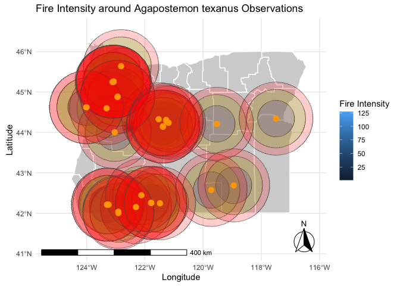

Exploring bee-related spatial data
================
Lauren Ponisio

<!-- Lesson Overview -->

# Conservation/ecology Topics

> - Species distributions

# Computational Topics

> - Convert a data frame to a spatial object.
> - Plot multiple spatial layers.

------------------------------------------------------------------------

# Lab part 1: Oregon bee atlas data exploration

1.  Import the OBA data.

``` r
OBAdata <- read.csv("OBA_2018-2023.csv")

head(OBAdata)
```

    ##                   Observation.No. Voucher.No. user_id     user_login
    ## 1 Andony_Melathopoulos:18.001.001              429964 amelathopoulos
    ## 2 Andony_Melathopoulos:18.002.001              429964 amelathopoulos
    ## 3 Andony_Melathopoulos:18.002.002              429964 amelathopoulos
    ## 4 Andony_Melathopoulos:18.002.003              429964 amelathopoulos
    ## 5 Andony_Melathopoulos:18.002.004              429964 amelathopoulos
    ## 6 Andony_Melathopoulos:18.002.005              429964 amelathopoulos
    ##   Collector...First.Name Collector...First.Initial Collector...Last.Name
    ## 1                 Andony                        A.         Melathopoulos
    ## 2                 Andony                        A.         Melathopoulos
    ## 3                 Andony                        A.         Melathopoulos
    ## 4                 Andony                        A.         Melathopoulos
    ## 5                 Andony                        A.         Melathopoulos
    ## 6                 Andony                        A.         Melathopoulos
    ##        Collectors taxon_kingdom_name Associated.plant...genus..species url
    ## 1 A.Melathopoulos                                                         
    ## 2 A.Melathopoulos                                                         
    ## 3 A.Melathopoulos                                                         
    ## 4 A.Melathopoulos                                                         
    ## 5 A.Melathopoulos                                                         
    ## 6 A.Melathopoulos                                                         
    ##   Sample.ID Specimen.ID Collection.Day.1 Month.1  MonthJul MonthAb Year.1
    ## 1                    NA               18     iii     March       3   2018
    ## 2                    NA               20     iii     March       3   2018
    ## 3                    NA               20     iii     March       3   2018
    ## 4                    NA               20     iii     March       3   2018
    ## 5                    NA                2      ix September       9   2018
    ## 6                    NA                2      ix September       9   2018
    ##   Collection.Date Time.1 Collection.Day.2 Month.2 Year.2 Collection.Day.2.Merge
    ## 1       3/18/2018                                                              
    ## 2       3/20/2018                                                              
    ## 3       3/20/2018                                                              
    ## 4       3/20/2018                                                              
    ## 5        9/2/2018                                                              
    ## 6        9/2/2018                                                              
    ##   Time.2    Collection.ID Position.of.1st.digit Collection.No. Sample.No.
    ## 1        A Melathopoulos                                     1          1
    ## 2         A Melathopoulos                                    2          1
    ## 3         A Melathopoulos                                    2          2
    ## 4         A Melathopoulos                                    2          3
    ## 5         A Melathopoulos                                    2          4
    ## 6         A Melathopoulos                                    2          5
    ##   Country  State  County                                        Location
    ## 1     USA Oregon  Benton                       Corvallis, NW Orchard Ave
    ## 2     USA Oregon  Benton                       Corvallis, NW Orchard Ave
    ## 3     USA Oregon  Benton                       Corvallis, NW Orchard Ave
    ## 4     USA Oregon  Benton                       Corvallis, NW Orchard Ave
    ## 5     USA Oregon Clatsop Clatskanie, Big Creek Mainline, Knob Point Road
    ## 6     USA Oregon Clatsop Clatskanie, Big Creek Mainline, Knob Point Road
    ##           Abbreviated.Location Collection.Site.Description          Team
    ## 1    Astoria Maggie Johnson Rd                             Melathopoulos
    ## 2 Big Crk. Mainline Knob Pt Rd                             Melathopoulos
    ## 3 Big Crk. Mainline Knob Pt Rd                             Melathopoulos
    ## 4 Big Crk. Mainline Knob Pt Rd                             Melathopoulos
    ## 5 Big Crk. Mainline Knob Pt Rd                             Melathopoulos
    ## 6 Big Crk. Mainline Knob Pt Rd                             Melathopoulos
    ##   Habitat Elevation..m. Dec..Lat. Dec..Long.  X Collectionmethod
    ## 1                          44.556   -123.285 NA              Net
    ## 2                          44.567   -123.283 NA              Net
    ## 3                          44.567   -123.283 NA              Net
    ## 4                          44.567   -123.283 NA              Net
    ## 5                          46.102   -123.506 NA              Net
    ## 6                          46.102   -123.506 NA              Net
    ##   Collection.method.merge.field Associated.plant...family
    ## 1                                                        
    ## 2                                                        
    ## 3                                                        
    ## 4                                                        
    ## 5                                                        
    ## 6                                                        
    ##   Associated.plant...genus..species.1 Associated.plant...Inaturalist.URL
    ## 1                                                                       
    ## 2                                                                       
    ## 3                                                                       
    ## 4                                                                       
    ## 5                                                                       
    ## 6                                                                       
    ##   Associated.plant Assoc.plant.merge.field          Collectors.1
    ## 1                                           Andony Melathopoulos
    ## 2                                           Andony Melathopoulos
    ## 3                                           Andony Melathopoulos
    ## 4                                           Andony Melathopoulos
    ## 5                                          Andony Melathopoulos 
    ## 6                                          Andony Melathopoulos 
    ##   Collector.1.abreviation Collector.2 Collector.3 Genus Species sex caste
    ## 1        A Melathopoulos           NA          NA                        
    ## 2         A Melathopoulos          NA          NA                        
    ## 3         A Melathopoulos          NA          NA                        
    ## 4         A Melathopoulos          NA          NA                        
    ## 5         A Melathopoulos          NA          NA                        
    ## 6         A Melathopoulos          NA          NA                        
    ##   vol.det.Genus vol.det.Species vol.det.sex.caste Determined.By Date.Determined
    ## 1                                                                            NA
    ## 2                                                                            NA
    ## 3                                                                            NA
    ## 4                                                                            NA
    ## 5                                                                            NA
    ## 6                                                                            NA
    ##   Verified.By Other.Determiner.s. Other.Dets.Sci..Name.s. Other.Dets..Date.s.
    ## 1          NA                                          NA                  NA
    ## 2          NA                                          NA                  NA
    ## 3          NA                                          NA                  NA
    ## 4          NA                                          NA                  NA
    ## 5          NA                                          NA                  NA
    ## 6          NA                                          NA                  NA
    ##   Additional.Notes X.1
    ## 1                   NA
    ## 2                   NA
    ## 3                   NA
    ## 4                   NA
    ## 5                   NA
    ## 6                   NA

2.  Find the columns related to genus and species and paste them
    together (with a space between) using the function paste(). Name the
    new column GenusSpecies.

``` r
GenusSpecies <- paste(OBAdata$Genus, OBAdata$Species, sep=" ", recycle0 = FALSE)

head(GenusSpecies)
```

    ## [1] " " " " " " " " " " " "

3.  Use `sort()` and `unique()` to print the unique values of
    GenusSpecies in alphabetical order. How many species are there?

``` r
head(sort(unique(GenusSpecies)))
```

    ## [1] " "                       "Agapostemon "           
    ## [3] "Agapostemon  femoratus"  "Agapostemon  texanus"   
    ## [5] "Agapostemon  virescens " "Agapostemon femoratus"

Some specimens are not identified to species, only genus. How is this
reflected in the data? In two weeks we will learn how to clean this up
using regular expressions.

4.  So many bees, so little time. Count up the occurrences of each bee
    species, and subset the data to bees that have been seen at least
    two times. You can use the tidyverse or any other functions in R
    that you like. How many “species” are there?

``` r
bee_counts <- OBAdata%>%
  mutate(GenusSpecies = paste(Genus, Species, sep=" ")) %>%
  group_by(GenusSpecies) %>%
  tally() %>%
  filter(n >= 2)

head(bee_counts)
```

    ## # A tibble: 6 × 2
    ##   GenusSpecies                  n
    ##   <chr>                     <int>
    ## 1 " "                       92466
    ## 2 "Agapostemon "              261
    ## 3 "Agapostemon  femoratus"    372
    ## 4 "Agapostemon  texanus"      150
    ## 5 "Agapostemon  virescens "    44
    ## 6 "Agapostemon femoratus"     165

``` r
num_species <- nrow(bee_counts)
num_species
```

    ## [1] 455

5.  Google a few bee names (that have been seen \> 2 times) and find one
    with an a look that resonates with you.

What is the name of your bee?

Agapostemon texanus

Import the photos into Rmarkdown below (hint: googling bee name
“discover life” or “inat” can often get you a photo. Many bees will no
have any photos :(

<figure>

<figcaption aria-hidden="true">Photo of Agapostemon texanus</figcaption>
</figure>

# Lab part 2: Plotting the distrubution of your spirit bee.

How that have chosen your spirit bee, we would like to plot it’s
distribution. What is the crs of the data? Annoyingly it is not
described anywhere in the spreadsheet (always list your crs in your
data) but it is the same as what inat uses because all bees have a
georeferenced plant host. If the data is in lat long, it is
“unprojected” so only a datum will be listed. DATUM: WGS84, unprojected
lat long. EPSG code: 4326.

``` r
crs("EPSG:4326")
```

    ## [1] "GEOGCRS[\"WGS 84\",\n    ENSEMBLE[\"World Geodetic System 1984 ensemble\",\n        MEMBER[\"World Geodetic System 1984 (Transit)\"],\n        MEMBER[\"World Geodetic System 1984 (G730)\"],\n        MEMBER[\"World Geodetic System 1984 (G873)\"],\n        MEMBER[\"World Geodetic System 1984 (G1150)\"],\n        MEMBER[\"World Geodetic System 1984 (G1674)\"],\n        MEMBER[\"World Geodetic System 1984 (G1762)\"],\n        MEMBER[\"World Geodetic System 1984 (G2139)\"],\n        ELLIPSOID[\"WGS 84\",6378137,298.257223563,\n            LENGTHUNIT[\"metre\",1]],\n        ENSEMBLEACCURACY[2.0]],\n    PRIMEM[\"Greenwich\",0,\n        ANGLEUNIT[\"degree\",0.0174532925199433]],\n    CS[ellipsoidal,2],\n        AXIS[\"geodetic latitude (Lat)\",north,\n            ORDER[1],\n            ANGLEUNIT[\"degree\",0.0174532925199433]],\n        AXIS[\"geodetic longitude (Lon)\",east,\n            ORDER[2],\n            ANGLEUNIT[\"degree\",0.0174532925199433]],\n    USAGE[\n        SCOPE[\"Horizontal component of 3D system.\"],\n        AREA[\"World.\"],\n        BBOX[-90,-180,90,180]],\n    ID[\"EPSG\",4326]]"

1.  Extract the X and Y locations for your species only from the data
    and create a spatial object. Don’t forget to set the CRS! Hint 1:
    consider what other data you would like to keep as attributes, for
    example what flower they were foraging on. Hint 2: Remember the lat
    is y and long is x. Hint 3: You may want to rename the column names
    you can use, colnames() and reassign the names, since the ones in
    the oba data spreadsheet are really ugly.

``` r
# Filter the data for Agapostemon texanus
spirit_bee_data <- OBAdata %>%
  filter(paste(Genus, Species, sep=" ") == "Agapostemon texanus") %>%
  select(Longitude = Dec..Long., Latitude = Dec..Lat., Flower = Associated.plant)

# Renames columns 
colnames(spirit_bee_data) <- c("Longitude", "Latitude", "Flower")

# Convert the filtered data to a spatial object
spirit_bee_sf <- st_as_sf(spirit_bee_data, coords = c("Longitude", "Latitude"), crs = 4326)

# Display the spatial object
print(spirit_bee_sf)
```

    ## Simple feature collection with 710 features and 1 field
    ## Geometry type: POINT
    ## Dimension:     XY
    ## Bounding box:  xmin: -124.408 ymin: 42.004 xmax: -116.935 ymax: 45.875
    ## Geodetic CRS:  WGS 84
    ## First 10 features:
    ##                  Flower                geometry
    ## 1                       POINT (-122.814 45.643)
    ## 2                       POINT (-122.814 45.643)
    ## 3                       POINT (-122.816 45.644)
    ## 4  Symphoricarpos albus POINT (-122.817 45.642)
    ## 5                       POINT (-123.074 45.258)
    ## 6                       POINT (-123.074 45.258)
    ## 7          Sidalcea sp.  POINT (-123.111 45.25)
    ## 8     Heracleum maximum POINT (-123.074 45.258)
    ## 9                       POINT (-123.135 45.202)
    ## 10                       POINT (-123.06 45.257)

``` r
spirit_bee_sf <- spirit_bee_sf[spirit_bee_sf$Flower != "",]
spirit_bee_sf <- spirit_bee_sf[spirit_bee_sf$Flower != "Salix sp., Achillea millefolium (Yarrow) and Conium maculatum (poison hemlock)",]
sort(unique(spirit_bee_sf$Flower))
```

    ##  [1] "Alcea rosea"                        "Berberis aquifolium"               
    ##  [3] "Calochortus macrocarpus"            "Chrysothamnus nauseosus"           
    ##  [5] "Cucurbita sp."                      "Ericameria nauseosa"               
    ##  [7] "Eriogonum sp."                      "Eriophyllum lanatum"               
    ##  [9] "Eriophyllum lanatum (Linear daisy)" "Eschscholzia californica"          
    ## [11] "Grindelia stricta stricta"          "Heracleum maximum"                 
    ## [13] "Ilex sp."                           "Jaumea carnosa"                    
    ## [15] "Leucanthemum vulgare"               "Lonicera tatarica"                 
    ## [17] "Potentilla gracilis"                "Rubus parviflorus"                 
    ## [19] "Rudbeckia hirta"                    "Senecio hydrophilus"               
    ## [21] "Sidalcea campestris"                "Sidalcea sp."                      
    ## [23] "Symphoricarpos albus"               "Symphyotrichum oolentangiense"     
    ## [25] "Trifolium repens"                   "Wyethia sp."

2.  Plot your exciting bee data!

``` r
ggplot(data = spirit_bee_sf) +
  geom_sf(color = "orange", size = 3, alpha = 0.6) + 
  labs(title = "Distribution of Agapostemon texanus",
       x = "Longitude",
       y = "Latitude") +
  theme_minimal()
```

<!-- -->

Not so exciting without some kind of background…

Luckily we can download basemaps into R using the map_data function in
ggplot (among many others). There is an example for retrieving the
Oregon county polygons.

``` r
or <- map_data("county", "oregon") %>% 
  select(long = long, lat, group, id = subregion)
```

3.  Add your species’s points to your choice or an Oregon basemap.

``` r
library(ggspatial)

ggplot() +
  geom_polygon(data = or, aes(x = long, y = lat, group = group), 
               fill = "lightgrey", color = "white") +
  
  geom_sf(data = spirit_bee_sf, color = "orange", size = 3, alpha = 0.7) +
  labs(title = "Distribution of Agapostemon texanus in Oregon",
       x = "Longitude", 
       y = "Latitude") +
  theme_minimal() +
  coord_sf()
```

<!-- -->
\# Lab part 3: Cartography

1.  Here is your moment to explore your cartographic skills.

<!-- -->

1.  Add another spatial layer relevant to your final project and tweek
    the Oregon map in anyway that is useful/visually appealing. You may
    need to crop that layer to the extent of your species’s
    distribution.
2.  Color your points according to some data attribute and add a legend
    (month collected, county, collector, associated plant, whatever you
    think is interesting). You may need to circle back to 2.1 to save
    additional attributes when you converted the dataframe to a spatial
    object.
3.  Fine-tune your map: add a title, make sure the legend label makes
    sense, add a scale bar (google “add scale bar map ggplot” and choose
    your favorite package). All maps must always have a scale bar. You
    can add a N arrow as well, though some cartographers argue that is
    only necessary if N isn’t at the top of the map.
4.  Write a figure caption for your map explaining any interesting
    trends you see.
5.  Export you cropped layer to a .shp so you can use it again for your
    final project.
6.  Push this lab to your github repo (just the .Rmd, don’t push the
    data!)

``` r
fire_data <- terra::rast("HolidayFarm_SBS_final.tif") 
fire_data <- terra::project(fire_data, st_crs(spirit_bee_sf)$wkt)
fire_data_cropped <- terra::crop(fire_data, terra::ext(spirit_bee_sf))
fire_df <- as.data.frame(fire_data_cropped, xy = TRUE, na.rm = TRUE)

or_sf <- st_as_sf(map_data("county", "oregon"), coords = c("long", "lat"), crs = 4326)
fire_data_oregon <- terra::crop(fire_data, terra::ext(or_sf))
fire_data_cropped <- terra::crop(fire_data_oregon, terra::ext(spirit_bee_sf))

ggplot() +
  # Oregon counties map
  geom_polygon(data = or, aes(x = long, y = lat, group = group), 
               fill = "lightgrey", color = "white") +
  geom_raster(data = fire_df, aes(x = x, y = y, fill = HolidayFarm_SBS_final)) +
  # Spirit bee data points
  geom_sf(data = spirit_bee_sf, aes(color =Flower), size = 3, alpha = 0.8) +
  # Add a scale bar
  annotation_scale(location = "bl", width_hint = 0.5) +
  # Add a north arrow
  annotation_north_arrow(location = "br", which_north = "true", 
                         style = north_arrow_fancy_orienteering) +
  labs(title = "Distribution of Agapostemon texanus and Wildfire Data",
       subtitle = "Colored by Associated Plant",
       color = "Associated Plant",
       fill = "Fire Intensity",
       x = "Longitude", 
       y = "Latitude") +
  theme_minimal() +
  
  theme(
    legend.position = "bottom", # Position legend at the top
    plot.title = element_text(hjust = 0.5, face = "bold", size = 14, margin = margin(b = 10)),
    plot.subtitle = element_text(hjust = 0.5, size = 12)
  ) +
  coord_sf()
```

<!-- -->

We are looking forward to seeing the maps you create!

# Lab part 4: Spatial summary statistics

For your final projects, you will likely need to come up with summary
statistics that describes the areas around where bees are captured. a.
Using the distribution of your chosen bee and the spatial layer you
imported in 2.6, extract a meaningful summary statistics from your
spatial layer within a buffer of 500, 750 1000 km. b. Create a plot that
illustrates this summary data (box plot, barplot, scatter plot,
historgram). c. Create a map of your cropped spatial data.

``` r
#alittle confused how to work with this fire dataset, I think this this incorrect, maybe if I used a better dataset, this would work better.

#Found this package online, that loads data faster???
library(exactextractr)

# Create buffers 
buffer_500 <- st_buffer(spirit_bee_sf, dist = 50000)  # 50 km
buffer_750 <- st_buffer(spirit_bee_sf, dist = 80000)  # 80 km
buffer_1000 <- st_buffer(spirit_bee_sf, dist =100000) # 100 km

# Extracts the mean fire intensity for each buffer distance
fire_mean_500 <- exact_extract(fire_data_cropped, buffer_500, fun = "mean")
```

    ##   |                                                                              |                                                                      |   0%  |                                                                              |==                                                                    |   3%  |                                                                              |====                                                                  |   6%  |                                                                              |======                                                                |   9%  |                                                                              |========                                                              |  11%  |                                                                              |==========                                                            |  14%  |                                                                              |============                                                          |  17%  |                                                                              |==============                                                        |  20%  |                                                                              |================                                                      |  23%  |                                                                              |==================                                                    |  26%  |                                                                              |====================                                                  |  29%  |                                                                              |======================                                                |  31%  |                                                                              |========================                                              |  34%  |                                                                              |==========================                                            |  37%  |                                                                              |============================                                          |  40%  |                                                                              |==============================                                        |  43%  |                                                                              |================================                                      |  46%  |                                                                              |==================================                                    |  49%  |                                                                              |====================================                                  |  51%  |                                                                              |======================================                                |  54%  |                                                                              |========================================                              |  57%  |                                                                              |==========================================                            |  60%  |                                                                              |============================================                          |  63%  |                                                                              |==============================================                        |  66%  |                                                                              |================================================                      |  69%  |                                                                              |==================================================                    |  71%  |                                                                              |====================================================                  |  74%  |                                                                              |======================================================                |  77%  |                                                                              |========================================================              |  80%  |                                                                              |==========================================================            |  83%  |                                                                              |============================================================          |  86%  |                                                                              |==============================================================        |  89%  |                                                                              |================================================================      |  91%  |                                                                              |==================================================================    |  94%  |                                                                              |====================================================================  |  97%  |                                                                              |======================================================================| 100%

``` r
fire_mean_750 <- exact_extract(fire_data_cropped, buffer_750, fun = "mean")
```

    ##   |                                                                              |                                                                      |   0%  |                                                                              |==                                                                    |   3%  |                                                                              |====                                                                  |   6%  |                                                                              |======                                                                |   9%  |                                                                              |========                                                              |  11%  |                                                                              |==========                                                            |  14%  |                                                                              |============                                                          |  17%  |                                                                              |==============                                                        |  20%  |                                                                              |================                                                      |  23%  |                                                                              |==================                                                    |  26%  |                                                                              |====================                                                  |  29%  |                                                                              |======================                                                |  31%  |                                                                              |========================                                              |  34%  |                                                                              |==========================                                            |  37%  |                                                                              |============================                                          |  40%  |                                                                              |==============================                                        |  43%  |                                                                              |================================                                      |  46%  |                                                                              |==================================                                    |  49%  |                                                                              |====================================                                  |  51%  |                                                                              |======================================                                |  54%  |                                                                              |========================================                              |  57%  |                                                                              |==========================================                            |  60%  |                                                                              |============================================                          |  63%  |                                                                              |==============================================                        |  66%  |                                                                              |================================================                      |  69%  |                                                                              |==================================================                    |  71%  |                                                                              |====================================================                  |  74%  |                                                                              |======================================================                |  77%  |                                                                              |========================================================              |  80%  |                                                                              |==========================================================            |  83%  |                                                                              |============================================================          |  86%  |                                                                              |==============================================================        |  89%  |                                                                              |================================================================      |  91%  |                                                                              |==================================================================    |  94%  |                                                                              |====================================================================  |  97%  |                                                                              |======================================================================| 100%

``` r
fire_mean_1000 <- exact_extract(fire_data_cropped, buffer_1000, fun = "mean")
```

    ##   |                                                                              |                                                                      |   0%  |                                                                              |==                                                                    |   3%  |                                                                              |====                                                                  |   6%  |                                                                              |======                                                                |   9%  |                                                                              |========                                                              |  11%  |                                                                              |==========                                                            |  14%  |                                                                              |============                                                          |  17%  |                                                                              |==============                                                        |  20%  |                                                                              |================                                                      |  23%  |                                                                              |==================                                                    |  26%  |                                                                              |====================                                                  |  29%  |                                                                              |======================                                                |  31%  |                                                                              |========================                                              |  34%  |                                                                              |==========================                                            |  37%  |                                                                              |============================                                          |  40%  |                                                                              |==============================                                        |  43%  |                                                                              |================================                                      |  46%  |                                                                              |==================================                                    |  49%  |                                                                              |====================================                                  |  51%  |                                                                              |======================================                                |  54%  |                                                                              |========================================                              |  57%  |                                                                              |==========================================                            |  60%  |                                                                              |============================================                          |  63%  |                                                                              |==============================================                        |  66%  |                                                                              |================================================                      |  69%  |                                                                              |==================================================                    |  71%  |                                                                              |====================================================                  |  74%  |                                                                              |======================================================                |  77%  |                                                                              |========================================================              |  80%  |                                                                              |==========================================================            |  83%  |                                                                              |============================================================          |  86%  |                                                                              |==============================================================        |  89%  |                                                                              |================================================================      |  91%  |                                                                              |==================================================================    |  94%  |                                                                              |====================================================================  |  97%  |                                                                              |======================================================================| 100%

``` r
# This will combine results into a DF
fire_summary <- data.frame(
  Distance = rep(c("50 km", "80 km", "100 km"), 
                 times = c(length(fire_mean_500), length(fire_mean_750), length(fire_mean_1000))),
  FireIntensity = c(fire_mean_500, fire_mean_750, fire_mean_1000)
)


ggplot() +
  geom_polygon(data = or, aes(x = long, y = lat, group = group), 
               fill = "lightgrey", color = "white") +
  geom_raster(data = fire_df, aes(x = x, y = y, fill = HolidayFarm_SBS_final)) +
  
  geom_sf(data = buffer_500, fill = "blue",alpha = 0.2 ) +
  geom_sf(data = buffer_750, fill = "green", alpha = 0.2) +
  geom_sf(data = buffer_1000, fill = "red", alpha = 0.2) +
  
  geom_sf(data = spirit_bee_sf, color = "orange", size = 3) +
  
  annotation_scale(location = "bl", width_hint = 0.5) +
  annotation_north_arrow(location = "br", which_north = "true", 
                         style = north_arrow_fancy_orienteering) +

  labs(title = "Fire Intensity around Agapostemon texanus Observations",
       fill = "Fire Intensity",
       color = "Buffer Distance",
       x = "Longitude", 
       y = "Latitude") +
        
  theme_minimal() +
  coord_sf()
```

    ## Scale on map varies by more than 10%, scale bar may be inaccurate

<!-- -->

``` r
ggplot(fire_summary, aes(x = reorder(Distance, -as.numeric(Distance)), y = FireIntensity, fill = Distance)) +
  geom_boxplot() +
  labs(title = "Mean Fire Intensity within Buffers of Agapostemon texanus",
       x = "Buffer Distance",
       y = "Mean Fire Intensity") +
  theme_minimal() +
  theme(legend.position = "none")
```

    ## Warning in tapply(X = X, INDEX = x, FUN = FUN, ...): NAs introduced by coercion

    ## Warning: Removed 83 rows containing non-finite outside the scale range
    ## (`stat_boxplot()`).

<!-- -->
